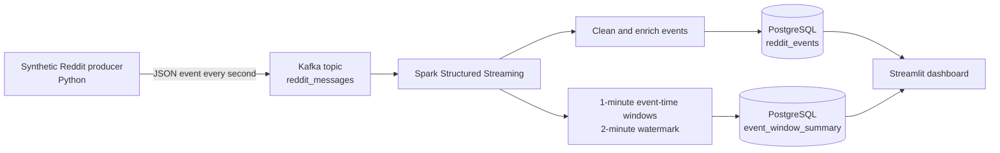
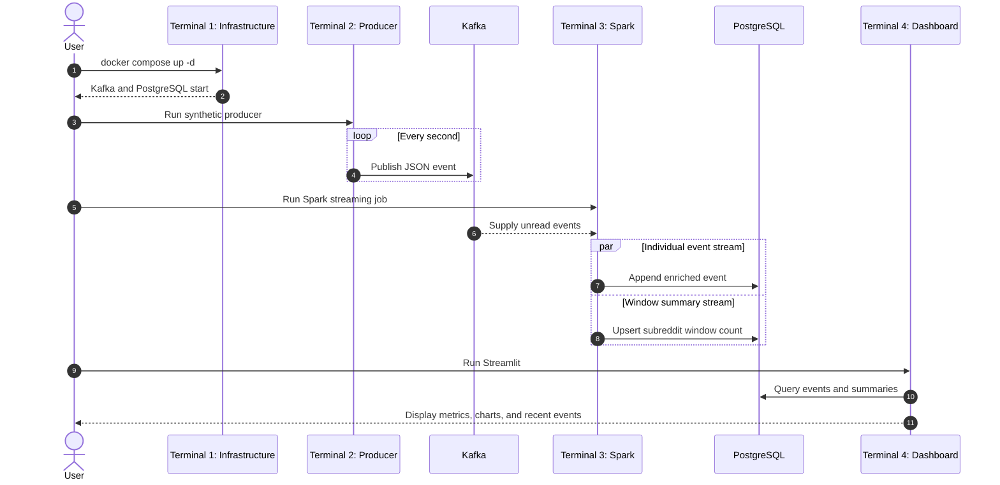

# Reddit Streaming Analytics Pipeline

An event-time data pipeline that moves Reddit-like text events through Kafka, processes two live Spark streams, persists detail and aggregate data in PostgreSQL, and serves the results in Streamlit.

> **Portfolio scope:** This repository currently uses a synthetic event source so the complete pipeline can be demonstrated without API credentials or external rate limits. Live Reddit ingestion and sentiment analysis are planned extensions.

## At a Glance

| Capability | Current implementation |
|---|---|
| Event ingestion | Python producer emits one structured event per second |
| Stream transport | Kafka topic named `reddit_messages` |
| Stream processing | PySpark parses, cleans, enriches, and aggregates events |
| Event-time handling | One-minute tumbling windows with a two-minute watermark |
| Persistence | Detailed events are appended; window summaries are upserted |
| Analytics | Streamlit refreshes PostgreSQL metrics, charts, and recent events every three seconds |
| Runtime | Kafka and PostgreSQL run locally with Docker Compose |

## Problem

Social conversations arrive continuously, not as a finished CSV. A useful analytics system must accept new events without stopping, tolerate events that arrive out of order, maintain time-based summaries, and expose the latest stored results to an analyst or stakeholder.

This project explores three practical questions:

1. How can producers and consumers be separated so each part can run independently?
2. How can event-time activity be summarized without retaining streaming state forever?
3. How can both detailed records and continuously changing aggregates be stored for a simple analytical dashboard?

## Dataset / Source

[`producer/reddit_producer.py`](producer/reddit_producer.py) generates Reddit-like JSON events from a small set of technology-focused messages. A UUID prevents accidental identifier reuse, and each event receives a UTC timestamp at creation.

### Incoming event contract

```json
{
  "id": "8f8d...",
  "subreddit": "dataengineering",
  "text": "Kafka makes streaming pipelines much easier to scale.",
  "created_at": "2026-08-24T10:30:00.000000+00:00"
}
```

| Field | Meaning | Used for |
|---|---|---|
| `id` | Unique event identifier | Event traceability |
| `subreddit` | Community associated with the message | Grouping and dashboard comparisons |
| `text` | Raw message content | Cleaning, length, size, and keyword features |
| `created_at` | UTC time assigned by the producer | Event-time windows and watermarking |

Synthetic input is deliberate at this stage: it makes the pipeline repeatable for reviewers and isolates infrastructure bugs from API authentication, rate limits, and source availability.

## Tech Stack

| Layer | Technology | Responsibility |
|---|---|---|
| Event generation | Python | Creates structured Reddit-like events |
| Message broker | Apache Kafka 4.3.1 | Buffers events and decouples ingestion from processing |
| Stream processing | PySpark 4.2.0 | Parses, enriches, and aggregates the stream |
| Operational analytics store | PostgreSQL 16 | Stores individual events and window summaries |
| Presentation | Streamlit + Pandas | Queries the stored data and renders analytics |
| Local infrastructure | Docker Compose | Starts Kafka and PostgreSQL consistently |

## Architecture / Workflow



The producer knows only how to publish events to Kafka. Spark independently subscribes to the topic and starts two streaming queries from the parsed data:

- The **detail stream** enriches each event and appends it to `reddit_events`.
- The **aggregate stream** counts events by subreddit and event-time window, then upserts the latest count into `event_window_summary`.

The dashboard does not read Kafka directly. It queries PostgreSQL, keeping presentation logic separate from stream processing.

## Stream Processing

[`spark/reddit_stream.py`](spark/reddit_stream.py) performs the following transformations:

| Transformation | Output | Analytical use |
|---|---|---|
| Text length | `text_length` | Average message length |
| Length classification | `text_size` | Short, medium, or long message grouping |
| Lowercase and punctuation removal | `clean_text` | Consistent text matching |
| Technology flags | `mentions_python`, `mentions_spark`, `mentions_kafka` | Topic mention counts |
| Timestamp parsing | `event_timestamp` | Event-time processing |
| Hour extraction | `event_hour` | Future time-of-day analysis |
| Windowed count | `event_count` | Activity per subreddit per minute |

### Event time and watermarking

The aggregation uses the timestamp created with the event rather than the time Spark happens to process it. A two-minute watermark bounds how long Spark retains old aggregation state while still allowing reasonably late events to update their window.

This is a deliberate correctness-versus-resource trade-off: events delayed beyond the watermark may not update an already finalized window.

## Storage Model

| Table | Grain | Write behavior | Purpose |
|---|---|---|---|
| `reddit_events` | One row per incoming event | Append | Detailed inspection and dashboard metrics |
| `event_window_summary` | One row per window start and subreddit | Upsert | Current activity count for each time window |

The summary table uses `(window_start, subreddit)` as its key. Spark's update output mode can emit the same open window multiple times as its count changes, so an upsert prevents those updates from becoming duplicate summary rows.

## Dashboard

[`dashboard/app.py`](dashboard/app.py) answers the current analytical questions:

- How many events have been stored?
- Which subreddit is currently most active?
- What is the average message length?
- How is activity distributed across subreddits?
- How does subreddit activity change across one-minute windows?
- How often are Python, Spark, and Kafka mentioned?
- What are the 20 most recent events?

The dashboard refreshes its PostgreSQL queries every three seconds and handles an empty database without failing. A recorded dashboard GIF will be added after the local display capture is completed.

## Engineering Decisions and Trade-offs

### Kafka between the source and Spark

Kafka allows the producer and Spark consumer to start, stop, or change independently. It also gives the stream a durable boundary that additional consumers could use later.

### Synthetic data before API integration

The current producer makes development repeatable and keeps credentials out of the critical path. It proves the event contract and processing pipeline before Reddit API behavior is introduced.

### Two streaming queries

Detailed events and window summaries have different storage semantics. Keeping them as separate queries makes the append path and the upsert path explicit, though it also means both queries need independent checkpointing and monitoring in a production design.

### PostgreSQL as the serving store

PostgreSQL is sufficient for a portfolio-scale analytical workload and is directly queryable by Streamlit. At higher scale, the sink and serving layer would need to be evaluated against throughput, retention, and query-latency requirements.

### Local single-broker infrastructure

Docker Compose makes the project inexpensive and reproducible on one machine. It demonstrates integration, not Kafka fault tolerance or distributed Spark execution.

## Results / Hiring Evidence

The repository currently demonstrates implementation evidence rather than benchmark claims:

| Evidence | Where to inspect it |
|---|---|
| Structured JSON Kafka producer | [`producer/reddit_producer.py`](producer/reddit_producer.py) |
| Kafka and PostgreSQL infrastructure | [`compose.yaml`](compose.yaml) |
| Schema parsing and event enrichment | [`spark/reddit_stream.py`](spark/reddit_stream.py) |
| Event-time windowing and watermark | [`spark/reddit_stream.py`](spark/reddit_stream.py) |
| JDBC detail writes and aggregate upserts | [`spark/reddit_stream.py`](spark/reddit_stream.py) |
| Database-backed dashboard queries | [`dashboard/app.py`](dashboard/app.py) |
| Reproducible dependency list | [`requirements.txt`](requirements.txt) |

The project has not yet been benchmarked, deployed as a distributed system, or validated by automated tests. Throughput, end-to-end latency, recovery behavior, and data-quality metrics should be recorded only after a repeatable test harness exists.

## How to Run

The sequence below shows which terminal owns each long-running process.



<details>
<summary><strong>Expand the complete local setup and run guide</strong></summary>

### Prerequisites

- Git
- Docker Desktop with Docker Compose
- Python 3.10 or later; Python 3.12 is recommended for this project
- Java 17 or later with `java` available on `PATH`

PySpark 4.2 supports Python 3.10+ and requires Java 17 or later.

### 1. Clone and enter the repository

Run once in a setup terminal:

```bash
git clone https://github.com/LukeOpany/reddit-streaming-pipeline.git
cd reddit-streaming-pipeline
```

### 2. Create the Python environment

Run once in the same setup terminal:

```bash
python3.12 -m venv .venv
source .venv/bin/activate
python -m pip install --upgrade pip
python -m pip install -r requirements.txt
```

If Python 3.12 is unavailable, use another supported Python 3.10+ executable and adjust the `SPARK_HOME` path in Terminal 3 accordingly.

### 3. Configure PostgreSQL

```bash
cp .env.example .env
```

Open `.env` and set a local password:

```env
POSTGRES_DB=reddit_pipeline
POSTGRES_USER=reddit
POSTGRES_PASSWORD=choose_a_local_password
POSTGRES_PORT=5433
```

Never commit `.env`; it is excluded by `.gitignore`.

### 4. Terminal 1 — start Kafka and PostgreSQL

```bash
cd reddit-streaming-pipeline
docker compose up -d
docker compose ps
```

Both `reddit_kafka` and `reddit_postgres` should report a running state.

Create the database tables once:

```bash
docker compose exec postgres psql -U reddit -d reddit_pipeline
```

At the PostgreSQL prompt, run:

```sql
CREATE TABLE IF NOT EXISTS reddit_events (
    id TEXT,
    subreddit TEXT,
    text TEXT,
    created_at TEXT,
    text_length INTEGER,
    text_size TEXT,
    clean_text TEXT,
    mentions_kafka INTEGER,
    mentions_spark INTEGER,
    mentions_python INTEGER,
    event_timestamp TIMESTAMP,
    event_hour INTEGER
);

CREATE TABLE IF NOT EXISTS event_window_summary (
    window_start TIMESTAMP NOT NULL,
    window_end TIMESTAMP NOT NULL,
    subreddit TEXT NOT NULL,
    event_count BIGINT NOT NULL,
    PRIMARY KEY (window_start, subreddit)
);

\q
```

### 5. Terminal 2 — start the synthetic producer

```bash
cd reddit-streaming-pipeline
source .venv/bin/activate
python producer/reddit_producer.py
```

The terminal should print one event each second. Leave it running.

### 6. Terminal 3 — start Spark Structured Streaming

```bash
cd reddit-streaming-pipeline
source .venv/bin/activate

SPARK_HOME="$PWD/.venv/lib/python3.12/site-packages/pyspark" \
PYSPARK_PYTHON="$PWD/.venv/bin/python" \
.venv/bin/spark-submit \
  --packages org.apache.spark:spark-sql-kafka-0-10_2.13:4.2.0,org.postgresql:postgresql:42.7.7 \
  spark/reddit_stream.py
```

The first run downloads the Kafka and PostgreSQL connector packages. Leave this terminal running after Spark starts processing batches.

### 7. Terminal 4 — start the dashboard

Wait until PostgreSQL contains some events, then run:

```bash
cd reddit-streaming-pipeline
source .venv/bin/activate
streamlit run dashboard/app.py
```

Open [http://localhost:8501](http://localhost:8501). The dashboard queries the latest stored data every three seconds.

### 8. Stop the project

Press `Control+C` in the producer, Spark, and Streamlit terminals. Then run:

```bash
docker compose down
```

</details>

## Repository Structure

```text
.
├── compose.yaml                 # Kafka and PostgreSQL services
├── producer/
│   └── reddit_producer.py       # Synthetic event producer
├── spark/
│   └── reddit_stream.py         # Streaming transformations and database writes
├── dashboard/
│   └── app.py                   # Streamlit analytics dashboard
├── requirements.txt             # Python dependencies
├── .env.example                 # Safe configuration template
└── .gitignore                   # Excludes secrets and local artifacts
```

## What the Project Demonstrates Now

- Kafka producer and topic-based event transport
- Spark Structured Streaming JSON parsing and enrichment
- Event-time aggregation with a watermark
- Independent detail and window-summary streams
- JDBC appends and idempotent PostgreSQL summary upserts
- Database-backed dashboard design
- Environment-based secret management

## Production Improvements

- Add dashboard filters and time-range controls.
- Add unit, integration, and data-quality tests with GitHub Actions.
- Add Docker health checks, persistent volumes, and automated schema initialization.
- Add Spark checkpoints and test restart/recovery behavior.
- Replace the synthetic source with an optional Reddit API producer.
- Add sentiment scoring and general keyword extraction.
- Measure throughput, end-to-end latency, late-event behavior, and write failures.
- Add structured logs, pipeline monitoring, and alerting.
- Capture a dashboard screenshot or short demo for the repository.
